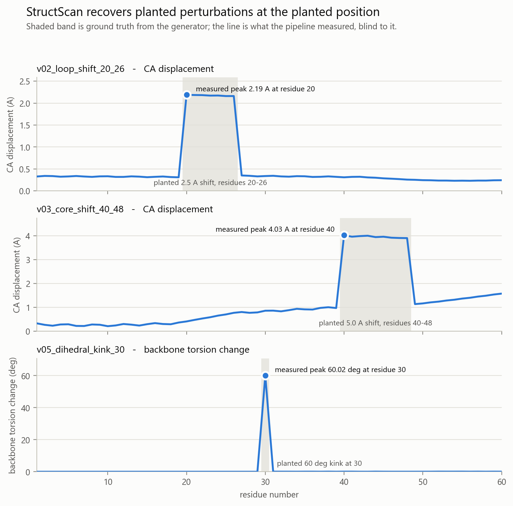
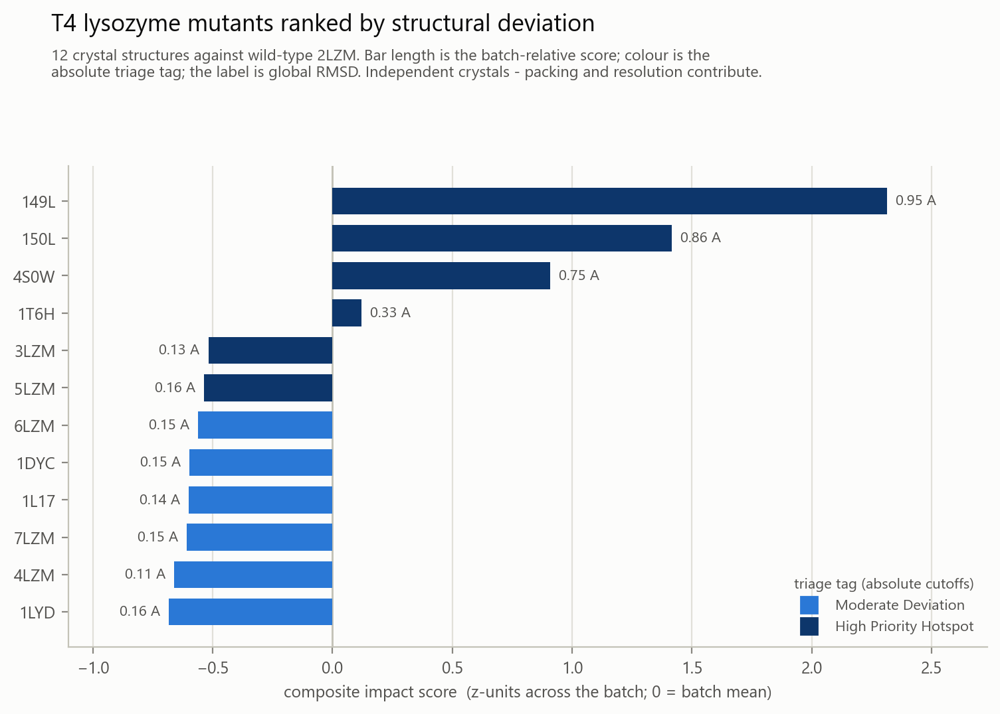

<h1 align="center">StructScan</h1>

<p align="center">
  <i>Screens hundreds of protein variant structures against a wild-type<br>
  reference and ranks them by where, and how much, the structure moved.</i>
</p>

<p align="center">
  <a href="https://github.com/yfeimei/StructScan/actions/workflows/tests.yml"></a>
  
  
  
  
</p>

<p align="center">
  <b><a href="https://yfeimei.github.io/StructScan/">Project page &amp; results</a></b> ·
  <b><a href="GETTING_STARTED.md">Getting started</a></b> ·
  <b><a href="PROJECT_GUIDE.md">Technical guide</a></b>
</p>

<p align="center">
  <picture>
    <source media="(prefers-color-scheme: dark)" srcset="docs/figures/validation-dark.png">
    
  </picture>
</p>

<p align="center">
  <sub><b>The pipeline, scored against structures whose distortion was planted in advance.</b><br>
  Shaded band = what was planted. Line = what StructScan measured, blind to it.</sub>
</p>

---

When a lab models or generates dozens or hundreds of protein variants, opening
every file individually in PyMOL or ChimeraX does not scale. StructScan runs a
batch pipeline over a directory of structures, computes geometric and positional
metrics against a wild-type reference, and emits a prioritised ranking report.

It is a **triage tool, not a functional-impact predictor.** It measures geometry.

## Results

A ranking over real structures can only show the pipeline produced *a* result —
not the *right* one. So it is scored against structures whose distortion is known
exactly: `tools/make_synthetic.py` plants a specific perturbation at a specific
residue and records it in `data/ground_truth.json`, **a file the pipeline never
reads.**

This is `output/ranked_hotspots.csv` from `python main.py`, with the planted
truth added alongside:

| # | Variant | What was planted into it | RMSD (Å) | Max shift (Å) | Max Δθ (°) | Triage tag | |
|--:|---|---|--:|--:|--:|---|:-:|
| 1 | `v05_dihedral_kink_30` | 60° torsion kink at residue 30 | 13.719 | 27.197 | **60.02** | High Priority Hotspot | ✔ |
| 2 | `v03_core_shift_40_48` | 5.0 Å rigid shift, residues 40–48 | 1.722 | 4.027 | 0.00 | High Priority Hotspot | ✔ |
| 3 | `v04_terminal_flex` | 4.0 Å terminal shift, residues 55–60 | 0.931 | 2.611 | 0.00 | High Priority Hotspot | ✔ |
| 4 | `v02_loop_shift_20_26` | 2.5 Å rigid shift, residues 20–26 | 0.796 | 2.189 | 0.00 | High Priority Hotspot | ✔ |
| 5 | `v07_gapped` | residues 10–14 deleted | 0.050 | 0.111 | 11.19 | Stable | ✔ |
| 6 | `v08_substitutions` | 3 residues substituted (15, 33, 50) | 0.054 | 0.104 | 9.81 | Stable | ✔ |
| 7 | `v01_stable` | coordinate noise, σ = 0.03 Å | 0.051 | 0.101 | 8.74 | Stable | ✔ |
| 8 | `v06_rigid_body` | rotated and translated in space | **0.001** | 0.001 | 0.14 | Stable | ✔ |

**Eight of eight triage tags match the planted expectation.** The four variants
built to be hotspots are flagged; the four built to be benign — including the two
designed to *look* alarming, a structure missing five residues and a structure
with three mutated side chains — are correctly called Stable.

Two rows carry most of the evidence. `v06_rigid_body` is the reference rotated
and translated through space — identical shape, completely different coordinates
— and it returns **0.001 Å**, because superposition is meant to remove motion
that isn't a shape change. And `v05_dihedral_kink_30` recovers **60.02° against a
planted 60°**.

The report localises each hit, too: `top_deviating_residues` for
`v03_core_shift_40_48` reads `A:40(4.03Å); A:43(4.01Å); A:42(3.99Å); A:41(3.96Å);
A:45(3.96Å)` — every one inside the planted 40–48 window, without the pipeline
being told where to look.

**The two results worth reading closely are the imperfect ones.** The rigid
shifts measure *low* — 2.19 Å for a planted 2.5 Å, 4.03 Å for a planted 5.0 Å —
because least-squares superposition distributes part of any local shift across
the whole fit. That is a property of superposition-based metrics rather than a
bug, and it is why the [limitations](#known-limitations) below are not
boilerplate. Ranks 2–4 also show *negative* composite scores while still tagged
High Priority Hotspot: the score is relative to the batch and `v05` drags the
mean up, while the tag is absolute. Both columns ship because neither answers the
other's question.

<details>
<summary><b>Terminal output from that run</b> (8 structures, ~1 second)</summary>

```
==============================================================================
StructScan - batch structural variant triage
==============================================================================
  Reference : wildtype_reference  [60 residues (60 with CA) across chain(s) A]
  Variants  : 8 file(s)
------------------------------------------------------------------------------
  [  1/8] v01_stable             RMSD  0.051 A   max shift  0.101 A   max dtheta   8.7 deg   matched 60
  [  2/8] v02_loop_shift_20_26   RMSD  0.796 A   max shift  2.189 A   max dtheta   0.0 deg   matched 60
  [  3/8] v03_core_shift_40_48   RMSD  1.722 A   max shift  4.027 A   max dtheta   0.0 deg   matched 60
  [  4/8] v04_terminal_flex      RMSD  0.931 A   max shift  2.611 A   max dtheta   0.0 deg   matched 60
  [  5/8] v05_dihedral_kink_30   RMSD 13.719 A   max shift 27.197 A   max dtheta  60.0 deg   matched 60
  [  6/8] v06_rigid_body         RMSD  0.001 A   max shift  0.001 A   max dtheta   0.1 deg   matched 60
  [  7/8] v07_gapped             RMSD  0.050 A   max shift  0.111 A   max dtheta  11.2 deg   matched 55
  [  8/8] v08_substitutions      RMSD  0.054 A   max shift  0.104 A   max dtheta   9.8 deg   matched 60
------------------------------------------------------------------------------
  Triage: 4 hotspot, 0 moderate, 4 stable  (of 8 analysed)

  Top 8 by composite impact score:
      #  variant                        score    RMSD  tag
      1  v05_dihedral_kink_30           2.607  13.719  High Priority Hotspot
      2  v03_core_shift_40_48          -0.182   1.722  High Priority Hotspot
      3  v04_terminal_flex             -0.319   0.931  High Priority Hotspot
      4  v02_loop_shift_20_26          -0.351   0.796  High Priority Hotspot
      5  v07_gapped                    -0.397   0.050  Stable
      6  v08_substitutions             -0.411   0.054  Stable
      7  v01_stable                    -0.423   0.051  Stable
      8  v06_rigid_body                -0.523   0.001  Stable

  Most frequently perturbed positions across the batch:
    A:60       ASP  displaced in   3/8 variants   max 27.20 A
    A:59       GLU  displaced in   3/8 variants   max 25.75 A
    A:58       LYS  displaced in   3/8 variants   max 24.02 A

  wrote ranked       -> output/ranked_hotspots.csv
  wrote per_residue  -> output/per_residue_detail.csv
  wrote hotspots     -> output/residue_hotspot_frequency.csv
==============================================================================
```

</details>

Alongside this, **16 tests pass** covering the dihedral wrap-around, RMSD against
its closed form, rigid-body invariance, recovery of each planted perturbation at
the correct residue, gap tolerance, and substitution handling.

## Quick start

Python 3.10 or newer.

```bash
pip install -r requirements.txt      # biopython, pandas, numpy
python tools/make_synthetic.py       # writes test structures into data/
python main.py                       # runs the batch, writes output/
```

Results land in `output/ranked_hotspots.csv`, sorted worst-first.

**New here? [`GETTING_STARTED.md`](GETTING_STARTED.md) is the full walkthrough** —
setup and virtual environments, what the output should look like, how to read
each report column, running on your own structures, and troubleshooting.

## Where the data comes from

The design assumes `data/wildtype_reference.pdb` and `data/variants/` already
exist. Two scripts populate them.

### Synthetic structures — `tools/make_synthetic.py`

Builds an idealised N-CA-C backbone from scratch, then derives eight variants in
which **the perturbation is known exactly**: a 2.5 A rigid shift of residues
20-26, a 60 degree torsion kink at residue 30, a rigid-body rotation that must
superimpose to zero, a version with residues 10-14 deleted, and so on. Ground
truth is written to `data/ground_truth.json`.

This is what `tests/` asserts against. Real structures can tell you the pipeline
produced *a* ranking; only planted perturbations tell you it produced the *right*
one. Runs offline in under a second.

### Real crystal structures — `tools/fetch_data.py`

```bash
python tools/fetch_data.py --limit 60
python main.py --reference data/t4_lysozyme/wildtype_reference.pdb \
               --variants  data/t4_lysozyme/variants \
               --output    output/t4_lysozyme --trim-outliers
```

Defaults to **T4 lysozyme** (wild-type `2LZM`). The Matthews lab solved an
unusually large series of single-point mutants of this protein against a common
wild-type — a sequence-identity search at 90% currently returns **499 entries**,
which is a genuine mutant batch rather than a contrived one. The script pulls the
reference sequence from the RCSB data API, runs the similarity search, and
downloads the hits. PDB coordinate data is public domain (CC0).

<picture>
  <source media="(prefers-color-scheme: dark)" srcset="docs/figures/t4-ranking-dark.png">
  
</picture>

Bar length is the batch-relative composite score and colour is the absolute triage
tag — the two mechanisms described under *Scoring and triage* below. They are
deliberately independent, which is why the colour blocks are not a clean split at
the zero line: `3LZM` and `5LZM` sit below the batch mean and still clear the
absolute hotspot cutoffs.

Other usable series: `--reference 1STN` (staphylococcal nuclease),
`--reference 1HHP` (HIV-1 protease, drug-resistance mutants).

**Caveat that belongs in any write-up:** these are independent crystals.
Crystal packing, resolution, bound ligands and crystallisation conditions all
contribute to the measured deviation alongside the mutation. A high-ranking
entry is not automatically a mutation effect.

## Output

| File | Contents |
|---|---|
| `ranked_hotspots.csv` | One row per variant, sorted by composite impact score, with triage tag |
| `per_residue_detail.csv` | Per-residue displacement and torsion deltas for every variant |
| `residue_hotspot_frequency.csv` | Per-position: how many variants perturb it — the batch-level hotspot view |
| `failed_structures.csv` | Files that could not be parsed or aligned, with the reason |

## The metrics

**Global RMSD** over matched alpha-carbons after superposition:

    RMSD = sqrt( (1/N) * sum_i ||r_i - r_i'||^2 )

**Local displacement** — per-residue Euclidean shift, to localise warping:

    d = sqrt( (x2-x1)^2 + (y2-y1)^2 + (z2-z1)^2 )

**Dihedral delta** — change in backbone phi/psi. Torsions are periodic, so this
is the *shortest* angular separation, in [0, 180]:

    dtheta = min( |a - b| mod 360, 360 - (|a - b| mod 360) )

A plain `|theta_mut - theta_ref|` scores 179 deg against -179 deg as 358 deg
apart when they are 2 deg apart. `tests/test_pipeline.py` pins this.

## Scoring and triage

Two independent mechanisms, both in the report:

- **Composite score** — weighted sum of z-scores across the batch. Answers *how
  does this variant rank against its peers*. This is the sort key.
- **Triage tag** — absolute angstrom/degree cutoffs. Answers *is this deviation
  large in physical terms*. `High Priority Hotspot` / `Moderate Deviation` /
  `Stable`.

Ranking alone would flag the top of every batch as interesting even when nothing
moved. Thresholds alone would give no ordering within a tag. Both are needed.

Tune with `--weight-rmsd`, `--weight-displacement`, `--weight-dihedral`,
`--rmsd-hotspot`, `--displacement-hotspot`, `--dihedral-hotspot`.

## Tests

```bash
python tests/test_pipeline.py     # standalone, no pytest needed
python -m pytest tests -q         # if pytest is installed
```

16 tests, all passing. They cover the dihedral wrap-around, RMSD against its
closed form, rigid-body invariance (to PDB's 0.001 A coordinate precision),
recovery of each planted perturbation at the correct residue, gap tolerance,
substitution handling, and that outlier trimming tightens the core fit without
hiding the displacement it excluded.

## Notes on the implementation

Three things the pipeline does that the original design did not specify, each
because the alternative produces wrong numbers rather than because it adds scope:

1. **Residues are matched by `(chain, resseq, icode)`, not by list index.** Real
   PDB entries have missing residues, insertion codes and chain-specific
   numbering; positional indexing silently misaligns them. Only the intersection
   of the two structures is compared, and coverage is reported.
2. **Dihedral deltas wrap.** See above.
3. **Residue identity is ignored when matching.** A point mutant differs in
   residue name at the mutated site by definition; substitutions are recorded in
   the report, not treated as a mismatch.

`--trim-outliers` (off by default, matching the original design) refits
iteratively while discarding atoms deviating more than `--trim-cutoff`, so one
mobile loop or disordered terminus cannot drag the whole superposition. Trimmed
atoms are excluded from the *fit*, not from the *report* — they are still
measured. On real crystal data this matters: without it, flexible termini
dominate.

One unreadable or mismatched file does not abort the batch; it is logged to
`failed_structures.csv` and the run continues.

## Known limitations

- **Superposition-based RMSD is dominated by rigid-body motion and flexible
  loops.** A buried point mutation can be devastating with near-zero RMSD; a
  floppy tail can produce large RMSD and mean nothing. Superposition-free
  metrics (lDDT, distance-difference matrices) are more robust for this purpose.
- **The composite score is an unvalidated heuristic.** The weights are chosen,
  not fitted, and nothing here has been benchmarked against known-pathogenic or
  known-benign variants. The ranking orders structures by geometric deviation —
  it does not predict functional impact.
- **Backbone only.** Alpha-carbon displacement and phi/psi say nothing about
  side-chain repacking, which is where much of a point mutation's local effect
  actually lands.
- **A single extreme outlier squashes the z-scores** of everything else in the
  batch, since the composite is normalised against batch spread. The absolute
  triage tags are unaffected.
- **On predicted structures** (AlphaFold/ESMFold and similar), backbones of point
  mutants are often nearly identical regardless of the mutation's real effect, so
  a geometric screen over predicted mutants may largely track prediction
  confidence rather than biology. Check pLDDT before trusting a ranking.
